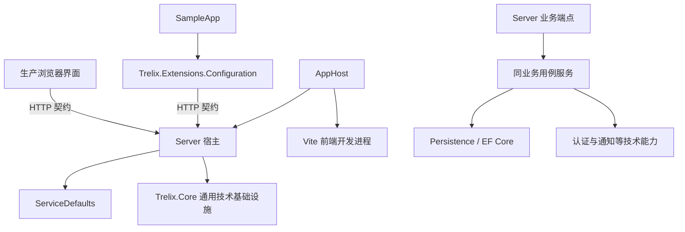
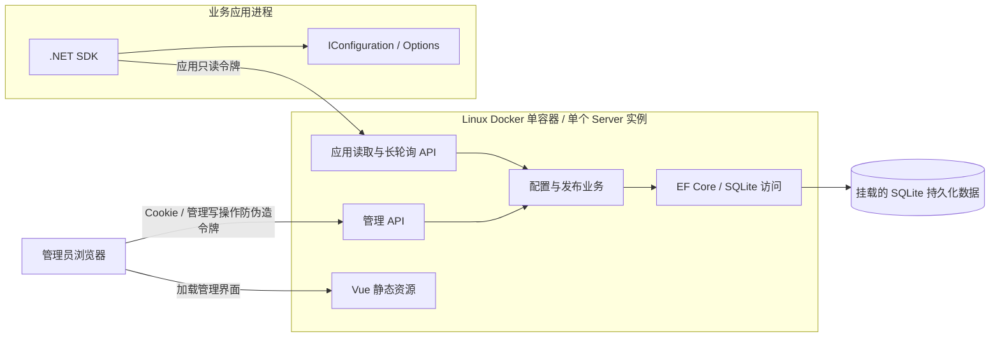
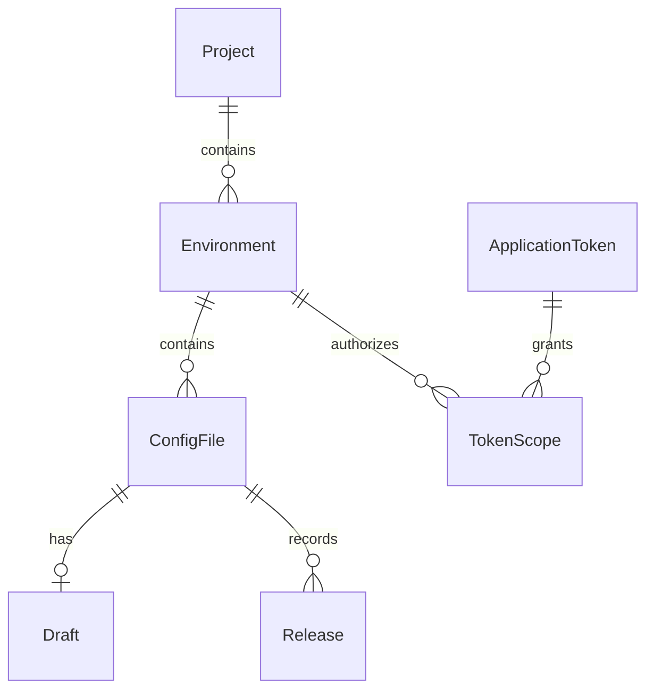
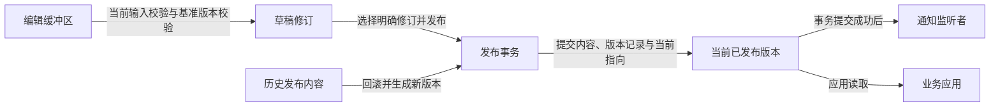

# Trelix 架构设计

本文规定轻量级配置中心的目标项目结构、模块职责、关键流程与程序边界，作为首版实施依据。目标采用轻量模块化单体：服务端业务按能力分目录，保持一个部署进程；.NET SDK 独立交付。产品行为以 [产品方案](product-plan.md) 为准，技术选择见 [技术基线](development-baseline.md)。

## 目标项目结构

以下为首版目标布局。目录和项目随对应功能建立，不为满足目录树创建空占位工程。Server 保留完整配置中心业务，内部按业务模块组织，不再拆分 Application、Domain、Infrastructure 类库；Core 承担通用技术基础设施，ServiceDefaults 承担宿主默认配置。三者在同一个 Server 进程中运行，不增加部署单元。

```text
Trelix/
├── Trelix.slnx
├── Directory.Build.props
├── Directory.Packages.props
├── global.json
├── nuget.config
├── docs/                                  产品、架构、技术、验收和操作文档
├── src/
│   ├── backend/
│   │   ├── Trelix.Server/
│   │   │   ├── Features/
│   │   │   │   ├── Authentication/        管理员初始化、会话与身份校验
│   │   │   │   ├── Projects/              项目与环境管理
│   │   │   │   ├── ConfigFiles/           文件身份、草稿与 JSON 校验
│   │   │   │   ├── Releases/              发布、历史版本与回滚
│   │   │   │   ├── ApplicationTokens/     应用令牌生命周期和授权范围
│   │   │   │   └── Distribution/          已发布配置读取与长轮询
│   │   │   ├── Persistence/
│   │   │   │   ├── Entities/              持久化实体
│   │   │   │   ├── Configurations/        EF 映射、索引与约束
│   │   │   │   ├── Migrations/            SQLite 数据库迁移
│   │   │   │   └── TrelixDbContext.cs
│   │   │   ├── Infrastructure/
│   │   │   │   ├── Authentication/        Cookie、令牌认证与授权策略
│   │   │   │   └── Notifications/         单实例内的变更通知与等待管理
│   │   │   └── Program.cs                 宿主装配与中间件入口
│   │   ├── Trelix.Core/
│   │   │   ├── Middleware/                通用异常处理与 HTTP 错误响应机制
│   │   │   ├── Serialization/             通用序列化辅助
│   │   │   └── Extensions/                通用技术组件注册入口
│   │   └── Trelix.ServiceDefaults/        遥测、健康检查、服务发现与 HTTP 弹性
│   ├── frontend/
│   │   ├── src/
│   │   │   ├── main.ts
│   │   │   ├── App.vue                    应用壳与页面组合
│   │   │   ├── pages/                     登录、工作区与令牌管理页面
│   │   │   ├── features/
│   │   │   │   ├── authentication/        会话、登录表单与失效处理
│   │   │   │   ├── workspace/             资源树、编辑、发布与历史交互
│   │   │   │   │   ├── components/
│   │   │   │   │   ├── composables/
│   │   │   │   │   ├── model/             编辑文档、修订和校验类型
│   │   │   │   │   └── formats/           JSON/YAML/Tree 表示转换
│   │   │   │   └── application-tokens/    应用令牌管理界面
│   │   │   ├── shared/
│   │   │   │   ├── api/                   HTTP 请求、错误和防伪造处理
│   │   │   │   ├── components/            跨业务复用的展示组件
│   │   │   │   └── types/                 公共前端契约类型
│   │   │   └── assets/                    全局样式与静态资源
│   │   └── tests/                         纯逻辑、组件与浏览器场景
│   ├── sdk/
│   │   └── Trelix.Extensions.Configuration/
│   │       ├── Configuration/            配置源、提供程序与加载快照
│   │       ├── Http/                     读取、监听和传输 DTO
│   │       ├── Hosting/                  后台监听与宿主生命周期
│   │       ├── Options/                  本地连接参数与校验
│   │       └── Extensions/               业务应用接入入口
│   └── Trelix.AppHost/                    本地资源编排
├── tests/
│   ├── Trelix.Server.Tests/               业务、HTTP、授权和真实 SQLite 测试
│   └── Trelix.Extensions.Configuration.Tests/
│                                          SDK、协议、配置优先级与重载测试
├── samples/
│   └── Trelix.SampleApp/                  使用 SDK 的独立业务应用示例
└── deploy/
    └── docker/                           容器构建与部署配套文件
```

`tests/` 下为 .NET 测试项目；前端测试留在前端工程内并使用同一 npm 依赖体系。`samples/` 是 SDK 使用方示例，不承担 Server 业务实现。`deploy/` 保存构建和部署资产，持久化数据及密钥不放入这些源码目录。

单个后端业务目录内就近放置 Minimal API Endpoints、用例服务、请求/响应 DTO 与业务校验。按功能需要建立文件，不机械地为每个用例生成接口、仓储或多层转发类。`Persistence` 负责 EF 映射和存取基础，用例服务可直接使用 DbContext，业务事务边界由用例服务控制，不再包装通用仓储。

## 依赖规则



- Server 是服务端业务和存储的唯一宿主；各业务目录之间通过明确用例协作，不跨模块调用端点处理器。
- Server 引用 Core 与 ServiceDefaults；Core 不引用 Server、ServiceDefaults、AppHost 或 SDK，不包含配置中心业务类型。Core 与 ServiceDefaults 分别由 Server 装配。
- HTTP DTO 与持久化实体分开；SDK 与前端通过公开 HTTP 契约交互，不引用 Server 程序集、EF Core 实体或数据库。
- ServiceDefaults 只提供公共运行能力，不反向引用 Server 或 SDK 业务类型。
- SDK 不依赖 Core、AppHost、ServiceDefaults、ASP.NET Core 管理端认证或 SQLite；宿主可自行采用 Aspire。
- 示例项目引用 SDK；测试项目引用被测项目，生产项目不引用测试或示例。
- 公共 SDK、构建属性、NuGet 版本与包源在项目根目录集中维护；目录结构不改变单实例部署边界。

## 系统边界

Trelix 提供配置管理、发布、已发布配置分发和 .NET 配置集成。管理界面与 Server 组成配置中心；SDK 在业务应用进程中运行，是独立交付物。业务应用如何使用配置以及如何重建已有连接池、单例对象，由业务应用负责。



图中表示首版目标部署与调用关系。生产交付边界见 [生产部署](deployment.md)；本地开发由 AppHost 分别运行 Server 和 Vite。

## 模块职责与依赖方向

| 模块 | 承担职责 | 边界 |
| --- | --- | --- |
| `src/frontend` | 管理员交互、资源选择、编辑文档状态、JSON/YAML/Tree 视图与 API 调用 | 不直接访问数据库；浏览器校验不能替代服务端校验和授权 |
| `src/backend/Trelix.Server` | 管理 API、应用 API、认证授权、配置校验、发布事务、历史版本与数据访问 | 业务逻辑留在 Server；Endpoints 处理 HTTP，复杂业务由应用服务承担 |
| `src/backend/Trelix.Core` | 通用异常处理、中间件、序列化辅助与技术组件注册扩展 | 不包含项目、环境、配置文件、发布版本等业务概念；不承载业务实体、DbContext、迁移或权限规则 |
| `src/backend/Trelix.ServiceDefaults` | 遥测、健康检查、服务发现和 HTTP 弹性 | 不依赖 Server 业务类型、实体、DbContext 或前端；Server 复用其注册 |
| `src/Trelix.AppHost` | 本地进程编排、连接信息传递与启动顺序 | 不保存配置业务数据，不执行配置发布；不承担生产容器中的应用入口 |
| `src/sdk/Trelix.Extensions.Configuration` | 读取已发布配置、监听变更、更新配置提供程序和发出重载通知 | 通过 HTTP 契约访问 Server，不依赖 Server 业务程序集或数据库；不执行管理员登录 |
| 业务应用 | 提供 SDK 启动连接信息、读取业务配置、响应配置重载 | 负责自身对象与资源的重新应用；远程配置不能改变 SDK 自身的连接目标 |

前端生产产物随 Server 交付，构建集成不表示浏览器与 Server 共享运行时。服务端按业务能力组织，目录分工不增加独立部署服务。

### 通用技术与业务基础设施边界

代码归属按其是否理解配置中心业务判断；使用 EF Core、认证或异步通知技术本身不构成进入 Core 的依据。

| 能力 | 归属与边界 |
| --- | --- |
| 通用异常捕获、Problem Details 输出机制 | Core 提供机制；业务错误标识及业务错误到 HTTP 的映射由 Server 定义并装配，Core 不引用业务异常类型 |
| 通用序列化辅助 | Core；配置正文的有效性、草稿修订和发布约束仍由 Server 的相关业务模块校验 |
| 配置中心持久化 | Server 的 Persistence；实体、DbContext、映射及迁移共同维护业务数据模型 |
| 管理员与应用令牌认证授权 | Server；凭证生命周期、项目与环境授权范围属于业务规则 |
| 发布通知与长轮询等待管理 | Server 的 Infrastructure/Notifications；按配置文件隔离，遵循提交后通知和持久化版本核对规则 |
| 遥测、健康检查、服务发现与 HTTP 弹性 | ServiceDefaults；Core 不重复提供这些宿主默认注册 |

Core 只随实际功能增加通用能力，不预建通用框架，不包装已有平台 API 以填充目录。业务功能及其专用基础设施在 Server 内维护，SDK 保持独立的客户端依赖边界。

## 业务模块与用例

| 模块 | 主要用例 | 负责的一致性与访问边界 |
| --- | --- | --- |
| Authentication | 首次初始化、登录、退出、会话检查 | 一个内置管理员管理全部项目与环境；不实现用户体系或 RBAC |
| Projects | 项目及所属环境管理、资源树查询 | 环境属于项目，资源身份不能跨项目混用 |
| ConfigFiles | 文件管理、读取与保存草稿、JSON 校验 | 文件属于环境；草稿与已发布内容分离，保存校验调用方基准 |
| Releases | 发布指定修订、查询历史、以历史内容回滚 | 在同一事务中生成版本并更新当前指向，提交成功后通知 |
| ApplicationTokens | 创建、到期、撤销、轮换、授权范围维护 | 只持久化令牌校验摘要；项目与环境授权适用于读取和监听 |
| Distribution | 读取当前发布内容、监听发布变化 | 应用令牌认证；不读取草稿，不提供管理写入能力 |

管理界面通过管理 API 使用前五类业务；SDK 仅调用 Distribution 的应用 API。读取与监听共享同一套资源授权规则，不能分别实现出不同访问边界。

## 数据与一致性边界

以下逻辑模型规定数据的归属、关联及一致性要求，持久化实体与 EF 映射据此实现。

管理员、令牌、配置及版本信息统一持久化到 SQLite。JSON 是唯一持久化正文格式，YAML 和 Tree 是前端编辑表示。存储实现遵循 [SQLite 约束](../src/backend/Trelix.Server/AGENTS.md#sqlite-与配置数据)。

### 逻辑模型与约束



草稿是文件当前可编辑内容及修订信息的逻辑组合，不要求为它额外引入历史草稿表。当前发布指向必须引用同一文件的不可变发布记录；未发布文件没有当前发布指向。

| 数据 | 必需的信息 | 一致性要求 |
| --- | --- | --- |
| Project | 项目标识与展示信息 | 项目身份唯一 |
| Environment | 所属项目、环境标识与展示信息 | 环境身份在所属项目内唯一 |
| ConfigFile | 所属环境、文件名、草稿修订、当前发布指向 | 文件名在所属环境内唯一；资源层级关系由服务端验证 |
| Draft | JSON 正文、草稿修订信息 | 保存后更新草稿基准，不改写已发布内容 |
| Release | 所属文件、版本号、不可变内容、发布时间与发布来源 | 同一文件内版本号唯一；回滚可追溯到源历史版本 |
| Administrator | 账号名、密码哈希与会话校验信息 | 首次初始化后重启不覆盖现有账号，不存储可还原密码 |
| ApplicationToken | 令牌标识、名称、校验摘要、有效期与撤销信息 | 不存令牌原文；有效性检查覆盖每次读取和监听 |
| TokenScope | 令牌与授权环境的关联 | 从环境归属确定项目，不允许将无关项目与环境拼成授权范围 |

唯一性与关联约束由数据库保障，API 校验提供清楚的错误反馈。时间在服务端按 UTC 处理，SQLite 映射必须支持所需比较与排序；接口时间表示与数据库存储表示分别设计。

当前 EF 模型将 UTC 时间转换为 SQLite INTEGER ticks，API 仍使用 DateTimeOffset。草稿正文及修订保存在 ConfigFile，Release 以 `(ConfigFileId, Version)` 为复合主键；当前发布指向与回滚来源通过同一文件内的复合外键关联。Administrator 的主键受单例检查约束保护；AdministratorSession 保存会话到期时间及管理员安全标记，每次 Cookie 请求重新核验。Data Protection 密钥和 SQLite 统一存放在外部可配置的数据目录，启动与迁移操作见 [本地开发](local-development.md#server-存储与首次初始化)。

项目和环境同样维护并发标记。重命名仅改变业务名称，不改变 ID、父子关系或令牌授权。文件删除先按并发基准清除当前发布指向，再批量删除历史并删除文件，所有写入处于同一事务；回滚来源外键使用 NO ACTION，使同一语句删除文件的全部历史时仍能在语句结束检查关联完整性。项目和环境删除由业务检查及数据库外键共同阻止仍被引用的资源删除。

### 修订与发布身份

草稿修订用于识别被编辑和选中发布的内容；发布版本用于识别应用可读取的历史内容；并发基准用于防止过期调用覆盖新操作。三者不能用前端请求时间或进程内自增计数代替。

所有改变文件的管理用例在持久化写入时校验调用方基准，不能只在读取时比较。SQLite 使用应用维护的并发标记和受影响行数校验，不依赖数据库生成的 rowversion；原理见 [EF Core 并发控制](https://learn.microsoft.com/en-us/ef/core/saving/concurrency)。

发布记录的不可变身份用于读取与监听比对，不能仅比较内存通知次数。新版本号的分配、历史记录插入、当前发布指向及并发标记更新必须处于同一受保护的事务内。



保存、发布和回滚均校验调用方基准版本；冲突时拒绝覆盖。事务提交成功前不得发送发布通知，失败不能留下部分发布结果。回滚不修改历史记录或倒退版本号。完整业务规则见 [草稿、发布与版本](product-plan.md#草稿发布与版本)。

### 发布流程

1. 管理 API 验证管理员身份、防伪造令牌和请求数据。
2. 用例服务读取配置身份、调用方基准和明确选中的草稿修订，独立校验 JSON。
3. 在短事务中校验并发条件、创建不可变发布记录、更新当前发布指向与并发标记。
4. 提交失败时返回可识别错误，不留下部分结果，不发出发布通知。
5. 提交成功后唤醒该文件的监听者；监听者通过持久化发布记录确认变化并读取内容。

Endpoints、事务服务、通知管理分别承担 HTTP、持久化和等待唤醒职责；等待客户端编辑或长轮询时不持有数据库事务。

M3 的发布服务先在事务内执行包含原始并发标记的文件 UPDATE，再读取文件已有最大版本并分配下一版本，插入发布记录、更新指向后提交。回滚使用源历史正文及其草稿修订，不覆盖当前草稿。通知管理与长轮询在 M5 接入；现有服务仅在成功提交后返回发布结果，未注册通知等待者。

## HTTP 与监听边界

管理 API 与应用 API 使用分离的路由分组、认证方案和 OpenAPI 分组。正式契约围绕下表的用例定义资源、请求和响应。

| 接口组 | 请求的核心信息 | 响应与边界 |
| --- | --- | --- |
| 管理会话 | 登录凭证、会话检查或退出请求 | Cookie 会话；不把应用令牌作为管理身份 |
| 项目与环境 | 资源标识及管理信息 | 资源身份和层级；每次操作验证实际归属 |
| 文件与草稿 | 文件身份、JSON 正文和并发基准 | 当前草稿、修订信息、校验或冲突结果 |
| 发布与回滚 | 文件身份、选中修订或历史发布、并发基准 | 新发布身份与版本信息；不修改历史记录 |
| 应用令牌管理 | 名称、授权范围与生命周期参数 | 令牌管理信息；校验摘要和其他认证内部信息不对外返回 |
| 应用读取 | 项目、环境、文件与 Bearer 应用令牌 | 所选文件当前已发布 JSON 及对应发布身份，不包含草稿 |
| 应用监听 | 相同文件身份、已知发布身份与 Bearer 应用令牌 | 变化结果或正常等待结束；授权拒绝和传输失败有明确区别 |

请求/响应使用独立 DTO，JSON 正文作为配置数据处理，不与传输元数据或持久化实体混在一起。错误使用 HTTP 状态码与 Problem Details，附带稳定错误标识及追踪信息，不附带原始配置、凭证或内部异常正文。400 表示输入无效，401/403 表示认证或授权失败，404 表示所请求资源不可用，409 表示并发或资源约束冲突。

管理写请求不由通用 HTTP 重试机制自动重放；失败后是否已经成功需重新读取并核对基准。API 的取消信号传递到下游 I/O；API 路由错误必须保留 API 错误响应，不能落入 SPA fallback 返回页面。错误与契约元数据遵循 [ASP.NET Core API 错误处理](https://learn.microsoft.com/en-us/aspnet/core/fundamentals/error-handling-api?view=aspnetcore-10.0)。

### 单实例长轮询

SQLite 中的当前发布记录是读取依据，进程内通知仅用于唤醒等待请求，不作为配置数据或发布历史的来源。

1. 验证应用令牌、项目与环境授权，解析所选文件。
2. 读取当前发布身份；与调用方已知身份不同则立即返回变化结果。
3. 注册该文件的等待者后再次核对发布身份，处理首次检查与注册之间发生发布的情况。
4. 等待通知、正常超时、请求取消或服务停止；等待期间不持有 DbContext 或数据库事务。
5. 唤醒后重新检查令牌有效性、授权和当前发布身份；只有成功发布的持久化结果才能报告变化。
6. 正常超时也核对当前发布身份，覆盖事务已提交但进程未成功通知的情况。客户端进入下一轮监听前保留已知发布身份。

通知管理按文件隔离等待者，结束时清理注册；服务重启后客户端重连并重新核对持久化版本，不依赖内存中的监听历史。HTTP 超时必须留出服务端等待和网络传输的余量。

## 身份与信任边界

| 调用方 | 凭证与允许的能力 | 服务端检查 |
| --- | --- | --- |
| 管理员浏览器 | 内置账号登录后使用 Cookie 执行管理操作 | 会话与管理策略；写操作校验防伪造令牌 |
| 业务应用 / SDK | Bearer 请求头携带应用只读令牌，读取和监听已发布内容 | 有效期、撤销状态、项目及环境授权；管理接口和草稿不向应用令牌开放 |
| 部署与本地启动环境 | 从源码之外注入初始化凭证和连接参数 | 首个管理员仅在不存在管理员时初始化；敏感信息不进入源码或镜像 |

认证失败返回 401，身份有效但权限不足返回 403。Cookie 与应用令牌使用分离的认证方案及授权策略；Bearer 携带方式不等于 JWT 或 OAuth 协议。详细规则见 [首版认证与访问控制](product-plan.md#首版认证与访问控制)。

配置正文只作为数据处理，不执行其中的代码。日志、错误响应和遥测不记录原始配置、密码、令牌、Cookie 或连接密钥；可观测性复用 ServiceDefaults，并避免包含配置值的高基数指标。

## 前端文档状态边界

统一文档状态维护当前文本、最后一次有效 JSON 数据、校验结果和修订信息。Monaco 与 Tree 通过明确动作更新状态；防抖解析失败时保留无效文本，不覆盖最后一次有效数据。

保存、发布或格式切换前同步校验当前输入，不能提交过期的有效数据。切换文件或环境时处理未保存内容并取消失效请求；编辑器实例、model 与订阅按所有权释放。转换与交互要求见 [编辑工作区](product-plan.md#编辑工作区)，实现约束见 [前端指引](../src/frontend/AGENTS.md#monaco-集成)。

| 前端单元 | 单一职责 | 输入与输出边界 |
| --- | --- | --- |
| 页面与 App.vue | 会话入口、页面布局和功能组合 | 组合业务组件，不实现完整编辑器与请求流程 |
| 资源树与环境选择 | 展示项目/环境/文件并提出选择请求 | 输入资源和当前选择，输出选择事件；不直接替换编辑缓冲区 |
| 工作区 composable | 加载、保存、发布、切换和过期请求取消 | 持有文档状态，通过动作修改；视图读取状态和执行动作 |
| Monaco 包装组件 | 编辑文本、展示校验、管理 model 生命周期 | 输入文本、语言和只读状态，输出编辑事件 |
| Tree 组件 | 展示与操作有效 JSON 数据 | 输出明确的数据变更动作，不直接改写 Monaco model |
| 历史与发布交互 | 选择修订、历史版本、发起发布或回滚 | 使用文件身份及并发基准，不携带应用令牌执行管理操作 |
| shared/api | 请求发送、Cookie/防伪造、取消和错误解析 | 返回类型化结果，不包含组件 UI 或数据库知识 |

当前编辑文本、有效 JSON、草稿修订、发布身份、并发基准分别维护；未保存、校验错误、加载失败与提交中也是不同维度，不压缩成一个“已修改”布尔值。派生视图从已有状态计算，业务视图间不建立双向监听链。组件和 composable 的组织遵循 [Vue 组合式函数](https://vuejs.org/guide/reusability/composables.html) 的职责分离原则。

## SDK 与宿主边界

`Trelix.Extensions.Configuration` 最低支持 .NET 10，目标框架为 `net10.0`，与服务端、示例及 .NET 测试项目一起继承根目录统一构建配置。兼容基线见 [技术基线](development-baseline.md#已确认的选择)。

SDK 通过自定义配置源及提供程序进入宿主配置系统，后台服务监听发布变更；更新提供程序后发出重载通知，不替换容器中的 `IConfiguration`。连接参数在首次拉取前来自本地启动配置，远程业务配置不承担自身访问凭证的引导职责。

一次接入绑定一个项目、环境和文件。SDK 内部区分本地连接参数、HTTP 传输结果、校验后的配置快照和配置提供程序；远程正文不能更改请求地址、文件选择或访问令牌。

### SDK 启动与更新流程

1. 从本地启动配置取得服务地址、项目、环境、文件和应用令牌，并校验完整性。
2. 在业务宿主构建完成和业务配置消费之前，通过异步接入入口完成首次拉取。配置提供程序加载已取得的快照，避免在同步 `Load()` 中阻塞网络 I/O。
3. 初始内容校验成功后按既定优先级注册配置源；首次拉取或校验失败则终止启动。
4. 宿主启动后台服务，以当前发布身份监听所选文件；收到变化后读取并校验完整发布内容。
5. 以完整新快照替换提供程序数据，再发出重载通知；旧响应、无效数据或失败请求不能覆盖最近成功快照。
6. 运行中失败保留内存中的最近成功配置，退避重试并输出不含敏感值的诊断；不回退到磁盘缓存。宿主停止时取消请求、终止后台循环并释放资源。

每个接入由一个后台循环串行协调更新，失效请求的响应不能写回。监听结果触发读取，最终快照使用读取响应中属于同一发布记录的正文与身份，不能将此前监听到的身份与后来读取的正文拼接。原生配置提供程序模型见 [.NET 自定义配置提供程序](https://learn.microsoft.com/en-us/dotnet/core/extensions/custom-configuration-provider)；首次异步拉取、远程监听与失败保留是 Trelix 自身承担的行为。

配置源优先级、Options 消费方式与宿主重新应用责任统一见 [.NET 配置集成](product-plan.md#net-配置集成)。读取和监听均执行应用令牌协议，长轮询的超时、重试与取消必须与监听契约一致。

## 运行边界

- 开发：AppHost 编排 `trelix-server` 与独立 Vite `trelix-client`，传递服务地址；Vite 代理 API 请求，使用 HTTPS 开发证书。
- 生产：Linux Docker 单容器内由 Server 提供管理界面静态资源与 API，SQLite 数据通过挂载持久化；不运行 Vite 开发服务器或 AppHost。
- 业务应用：独立于配置中心部署，通过地址、项目、环境与应用令牌连接；Trelix 配置环境与 ASP.NET Core 运行环境分别管理。

具体开发命令见 [本地开发](local-development.md)，生产要求见 [生产部署](deployment.md)，阶段交付见 [交付里程碑](milestones.md)。
